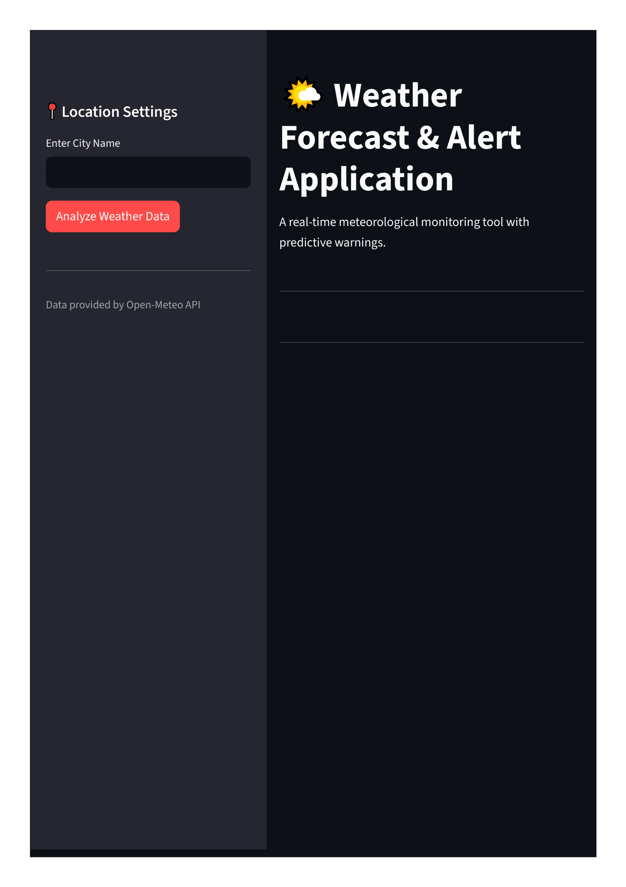
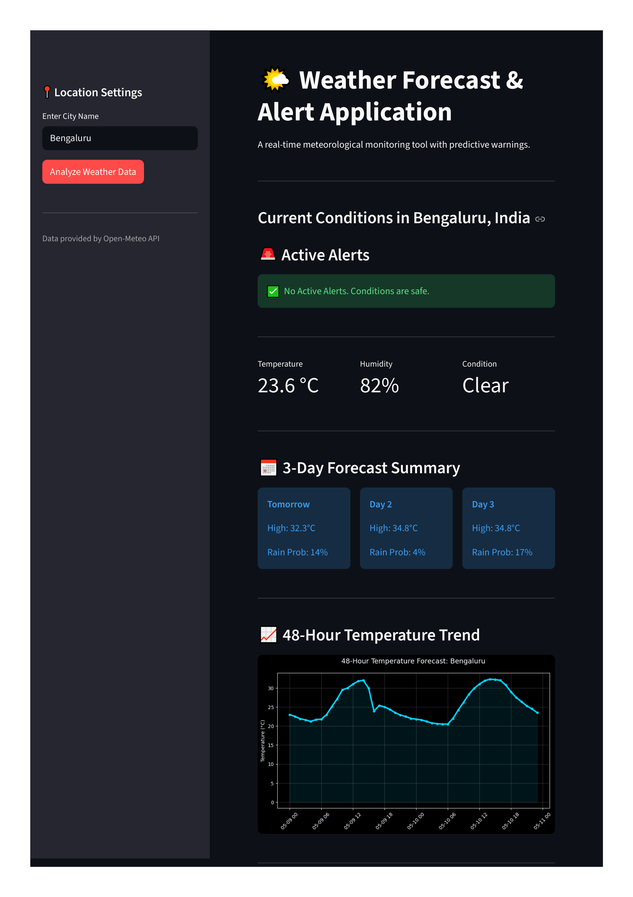

# 🌤️ Weather Forecast & Alert Application


## 📌 Project Overview
A real-time, interactive meteorological monitoring tool that fetches live satellite data, analyzes weather patterns, and provides predictive warnings. The application integrates live APIs, automates data processing, handles geospatial routing, and renders data visualizations

The project operates as a fully functional web dashboard, converting complex JSON forecast arrays into actionable insights and professional visual trends.

## 🚀 Features
* **Real-Time Data Integration:** Connects to the Open-Meteo API for live, coordinate-based weather data (No API key required).
* **Smart Alert Engine:** Analyzes 48-hour precipitation probabilities and temperature thresholds to trigger autonomous Heatwave, Rain, and Humidity warnings.
* **Geospatial Processing:** Utilizes `geopy` to automatically convert city names into precise Latitude/Longitude coordinates.
* **Interactive Dashboard:** Built with Streamlit for a clean, user-friendly UI.
* **Predictive Analytics:** Generates 3-day forecast grids and 48-hour temperature trend visualizations using Matplotlib.
* **Automated Data Logging:** Automatically archives weather query results into persistent CSV files for historical analysis.

---

## 📸 Dashboard Preview

### 1. The Alert Console & Current Metrics
*(This section displays active weather warnings based on real-time data.)*



### 2. Predictive Forecasting & Visualization
*(This section shows the 3-day forecast grid and the 48-hour temperature trend.)*



---

## 🛠️ Tech Stack & Architecture
* **Language:** Python
* **Web Framework:** Streamlit
* **Data Processing:** Pandas, JSON
* **Visualization:** Matplotlib
* **APIs & Libraries:** Requests, Geopy (Nominatim), Open-Meteo API

### 📂 Folder Structure
```text
Weather-Forecast-Alert-Application/
│
├── images/               # Screenshots for documentation
├── outputs/              # Auto-generated visualization charts (*.png)
├── reports/              # Auto-generated historical logs (*.csv)
├── src/                  # Core application logic
│   ├── __init__.py
│   ├── api_handler.py    # Handles geospatial routing & API requests
│   ├── logic_engine.py   # Processes JSON arrays & triggers alerts
│   └── report_generator.py # Pandas CSV logging & Matplotlib rendering
│
├── main.py               # Streamlit dashboard engine (Entry Point)
├── requirements.txt      # Project dependencies
└── .gitignore            # Ignored files (venv, pycache, local logs)

```

---

## ⚙️ Installation & Usage

### 1. Clone the Repository

```bash
git clone [https://github.com/yourusername/weather-forecast-alert-app.git](https://github.com/yourusername/weather-forecast-alert-app.git)
cd weather-forecast-alert-app

```

### 2. Set Up a Virtual Environment (Recommended)

**Windows:**

```bash
python -m venv venv
venv\Scripts\activate

```

**Mac/Linux:**

```bash
python3 -m venv venv
source venv/bin/activate

```

### 3. Install Dependencies

```bash
pip install -r requirements.txt

```

### 4. Run the Application

Start the Streamlit server to launch the dashboard in your browser:

```bash
streamlit run main.py

```

---

## 🧠 Technical Highlights 

* **Modular Design:** The project architecture cleanly separates the User Interface (`main.py`), Data Retrieval (`api_handler.py`), Business Logic (`logic_engine.py`), and Storage (`report_generator.py`).
* **Error Handling:** Gracefully handles invalid city inputs and API timeout failures without crashing the application.
* **Dynamic Generation:** The `outputs` and `reports` directories are autonomously generated at runtime via the `os` library, ensuring the application is portable and clean upon initial clone.
* **Data Security:** By utilizing Open-Meteo, the application avoids hardcoded secrets and environment variables, ensuring the application is instantly executable upon cloning.

